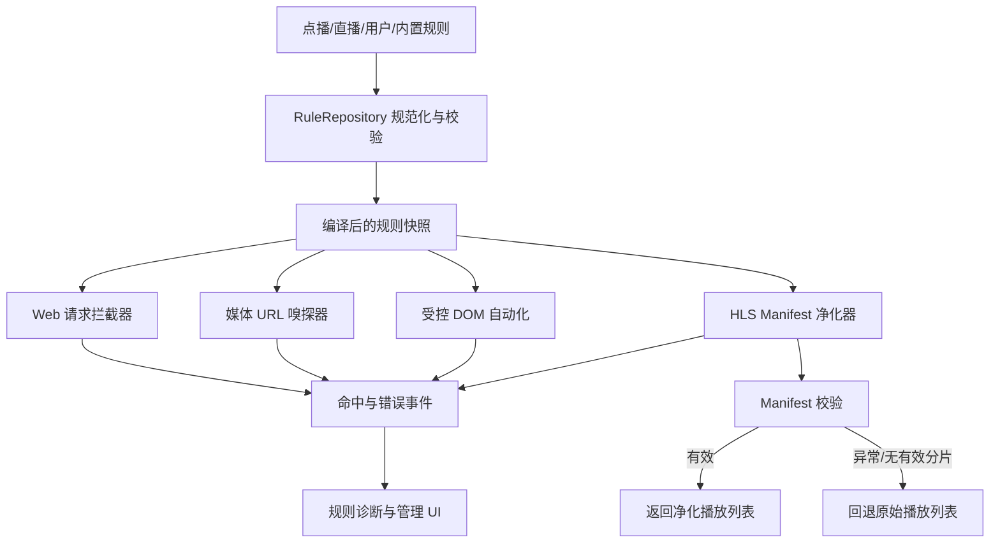

# 智能去广告能力升级设计（V2）

> 状态：Accepted，Phase 1 实施中
>
> 日期：2026-07-12
>
> 适用项目：webhtv Android（mobile / leanback）
>
> 目标版本：分阶段交付，不绑定单一 APK 版本

当前实施进度（2026-07-12）：已加入纯 Java HLS manifest 净化核心、完整分片删除安全阈值、原文回退、时长/断点/跨域多信号、独立顶层 `hlsRules` 配置和编译快照，并通过共享管线统一 `/m3u8` 与 MPV/IJK 代理。live playlist 现仅允许删除连续头部分片，并同步调整 `MEDIA-SEQUENCE` 与 `DISCONTINUITY-SEQUENCE`；中间删除、BYTERANGE、序列缺失或其他不安全结构均回退原文。Phase 2 已加入 schemaVersion 2 的 APK 内置规则包、稳定复合状态键、默认关闭与用户 override、备份同步、规则状态摘要，以及 mobile/leanback 管理 UI 的只读详情、错误提示和单条开关。首批加入暴风、量子、非凡三条实验规则，全部默认关闭，并分别具有断点正样本、无断点反样本和错误 host 反样本。

## 1. 背景与结论

当前项目已经具备以下能力：

- 从点播、直播配置读取 `ads` 与 `rules`；
- 按页面 host 应用 `hosts / exclude / regex / script`；
- WebView 广告请求拦截、媒体 URL 嗅探和页面自动点击；
- 用户规则持久化、默认规则禁用、规则来源与命中记录；
- 采集 M3U8 分片、时长、`#EXT-X-DISCONTINUITY` 和跨域信息，辅助 AI 生成候选规则。

当前最关键的能力缺口是：**本地 M3U8 代理只重写分片 URI，没有删除广告分片。** 因而将“量子 7.166667 秒”等 manifest 正则直接放入现有 `Rule.regex` 或 `Rule.exclude` 不会生效，因为这些字段目前只匹配媒体请求 URL，不匹配 M3U8 正文。

本次升级的核心决策是：

1. 保留现有 URL 嗅探与 WebView 拦截能力；
2. 新增结构化 HLS manifest 净化引擎；
3. 将规则拆分为明确的作用域，避免同一个 `regex` 同时承担相反语义；
4. 内置规则必须可禁用、可更新、可回滚、可观测；
5. AI 只生成“待审核候选”，不得直接执行远程脚本或自动启用高风险规则；
6. OmniBox 式编码指纹检测只作为可选高级后端，不作为手机端首期依赖。

## 2. 目标与非目标

### 2.1 目标

- 删除 HLS 片头或片中硬插的广告分片，同时保持 manifest 可播放；
- 拦截解析网页中的广告、统计和弹窗请求；
- 自动执行受控的“点击播放/关闭遮罩”动作；
- 提升媒体地址嗅探准确率，降低伪媒体 URL 误判；
- 支持内置、接口、用户、AI 候选四类规则统一管理；
- 支持规则命中记录、误杀恢复、单条禁用和安全回退；
- 保持旧版 TVBox 风格 `ads/rules` 配置兼容。

### 2.2 非目标

- 不承诺绕过 DRM、付费鉴权或平台会员广告；
- 不在首期集成 ffprobe 或下载完整媒体进行内容识别；
- 不默认执行来源不可信的任意 JavaScript；
- 不把磁力标题净化和媒体请求过滤混为同一种规则；
- 不维护规模庞大且无法验证的博彩、色情关键词库。

## 3. 成功标准

### 3.1 功能验收

- 给定包含广告区块的测试 manifest，净化后广告分片及其关联标签被完整删除；
- 无匹配规则、规则异常或净化结果非法时，播放器自动使用原始 manifest；
- master playlist、media playlist、相对 URI、绝对 URI和带查询参数 URI 均能正确处理；
- 旧配置中的 `ads/rules` 无需修改即可继续工作；
- 用户可以查看、启用、禁用和回滚每条内置规则；
- 自动点击规则只能在限定 host、限定动作和限定执行时机下运行；
- 所有外部正则在进入请求热路径前完成校验和预编译。

### 3.2 质量指标

- 无规则时 manifest 代理额外处理耗时 P95 小于 20 ms（不含上游网络）；
- 仅结构化规则匹配时额外处理耗时 P95 小于 50 ms；
- 净化失败回退率可统计，且失败不会中断播放；
- 单个 manifest 默认最大 2 MiB、最大 20,000 行，超限直接回退；
- 规则包更新失败不影响当前已验证版本；
- 单条规则可定位命中次数、最后命中时间和对应来源。

## 4. 总体架构



### 4.1 模块边界

| 模块 | 职责 | 不负责 |
|---|---|---|
| `RuleRepository` | 合并来源、版本迁移、校验、编译、快照切换 | 直接拦截请求 |
| `RequestAdBlocker` | 按 host/URL/资源类型拦截 Web 请求 | 解析 M3U8 |
| `MediaSniffer` | 识别真实媒体 URL，应用 include/exclude | 删除广告分片 |
| `DomAutomationEngine` | 执行受控点击、移除遮罩等动作 | 执行任意远程 JS |
| `HlsManifestCleaner` | 解析、匹配、删除、重建 media playlist | 媒体内容解码 |
| `RuleTelemetry` | 命中、失败、回退和耗时记录 | 上传原始敏感 URL |
| `AdRuleManager` | 规则展示、禁用、导入、导出和诊断 | 在 UI 主线程编译正则 |

## 5. 规则协议 V2

### 5.1 顶层结构

```json
{
  "schemaVersion": 2,
  "packageId": "builtin-cn-video",
  "version": 1,
  "updatedAt": "2026-07-12T00:00:00Z",
  "rules": []
}
```

单条规则：

```json
{
  "id": "builtin.example.preroll.v1",
  "name": "示例站片头广告",
  "description": "删除限定域名下、断点边界内的短广告区块",
  "version": 1,
  "enabledByDefault": false,
  "source": "builtin",
  "priority": 100,
  "scope": {
    "pageHosts": ["player.example.com"],
    "mediaHosts": ["cdn.example.com"],
    "urlPrefixes": ["https://cdn.example.com/"],
    "sourceKeys": []
  },
  "requestBlock": {},
  "sniff": {},
  "automation": {},
  "hls": {},
  "textSanitize": {}
}
```

### 5.2 公共字段

| 字段 | 说明 |
|---|---|
| `id` | 稳定 ID，不从规则正文动态计算；升级时保持不变 |
| `version` | 单条规则版本，便于覆盖和迁移 |
| `source` | `builtin/interface/user/ai/imported` |
| `priority` | 数字越大越先执行；同优先级按稳定 ID 排序 |
| `enabledByDefault` | 内置规则默认状态；高风险规则默认关闭 |
| `scope` | 规则适用范围，至少命中一个明确 host 才允许执行高风险动作 |
| `expiresAt` | 可选；过期规则停止执行但保留诊断信息 |

### 5.3 请求拦截规则

```json
{
  "requestBlock": {
    "hostSuffixes": ["ads.example.com"],
    "urlRegex": ["/commercial/", "[?&]ad_id="],
    "resourceTypes": ["image", "script", "xhr", "media"],
    "response": "empty"
  }
}
```

约束：

- `media` 类型拦截默认禁止，必须同时限定 `pageHosts` 和 `mediaHosts`；
- host 按完整域名或点边界后缀匹配，禁止简单 `contains`；
- 先执行正片保护规则，再执行广告拦截规则；
- 外部配置中的旧 `ads` 转换为低优先级 `hostSuffixes`。

### 5.4 媒体嗅探规则

```json
{
  "sniff": {
    "includeRegex": ["is_play_url=", "\\.m3u8(?:\\?|$)"],
    "excludeRegex": ["/analytics/", "[?&]preview=1"],
    "requiredContentTypes": ["application/vnd.apple.mpegurl"],
    "preserveRequestHeaders": true
  }
}
```

执行顺序：`exclude → include → Content-Type → 通用媒体格式`。旧 `Rule.exclude` 映射到 `sniff.excludeRegex`，旧 `Rule.regex` 映射到 `sniff.includeRegex`。

### 5.5 DOM 自动化规则

首选声明式动作，不首选任意脚本：

```json
{
  "automation": {
    "runAt": "document_idle",
    "maxRuns": 3,
    "intervalMs": 500,
    "timeoutMs": 3000,
    "actions": [
      { "type": "click", "selector": "#clickText", "ifVisible": true },
      { "type": "remove", "selector": ".popup-mask" }
    ]
  }
}
```

允许动作首期仅包括：

- `click(selector)`；
- `remove(selector)`；
- `setAttribute(selector, name, value)`，属性白名单；
- `pause(ms)`，单次最大 1 秒。

兼容旧 `script` 时：

- 仅允许用户本地规则或可信签名规则包；
- 禁止访问 Android JS bridge；
- 设置总执行超时和执行次数；
- 管理界面明确标记“任意脚本，高风险”。

### 5.6 HLS 结构化规则

```json
{
  "hls": {
    "mode": "remove-segment-group",
    "match": {
      "segmentUrlRegex": ["/ads?/", "/preroll/"],
      "hostSuffixes": ["ad-cdn.example.com"],
      "durationRange": { "min": 6.8, "max": 7.4 },
      "totalDurationRange": { "min": 5, "max": 60 },
      "requireDiscontinuityBoundary": true,
      "requireCrossDomain": true,
      "position": "head"
    },
    "minimumSignals": 2,
    "preserveTags": ["#EXT-X-KEY", "#EXT-X-MAP"],
    "onInvalidResult": "fallback"
  }
}
```

`minimumSignals` 表示至少同时满足多少个独立证据。内置规则不得只凭“固定时长”这一项删除分片，除非规则严格限定媒体 host 且已有人工验证样本。

支持的结构化证据：

- 分片 URL 正则；
- 分片 host；
- 单片时长范围；
- 区块总时长范围；
- `DISCONTINUITY` 边界；
- 相对主 manifest 的跨域切换；
- 区块位置：`head/middle/tail/any`；
- 连续分片数量范围；
- URI 查询参数或路径标志。

### 5.7 文本净化规则

磁力和标题中的垃圾词作为独立模块：

```json
{
  "textSanitize": {
    "targets": ["torrent_file_name", "vod_title", "vod_remarks"],
    "removeRegex": ["【[^】]*(?:博彩|裸聊)[^】]*】"],
    "dropItemRegex": [],
    "replacement": ""
  }
}
```

默认只删除明确包裹的广告片段，不因命中单个敏感词删除整个文件或资源。

## 6. HLS Manifest 净化算法

### 6.1 处理入口

沿用现有本地代理。在确认 URL 为 HLS 且去广开关开启时：

1. 下载原始 manifest，保留必要请求 headers、Cookie 和 Referer；
2. 限制响应大小、重定向次数和协议；
3. 区分 master playlist 与 media playlist；
4. master playlist 只重写子清单 URI，不在该层删除媒体区块；
5. media playlist 进入结构化解析和过滤；
6. 结果校验通过后返回净化文本，否则返回原始文本。

### 6.2 数据模型

```java
final class HlsManifest {
    List<HlsNode> nodes;
    boolean master;
    long mediaSequence;
}

sealed interface HlsNode {}
final class GlobalTag implements HlsNode {}
final class SegmentEntry implements HlsNode {
    List<String> leadingTags;
    float durationSec;
    String title;
    String uri;
    boolean discontinuityBefore;
    String keyContext;
    String mapContext;
}
```

解析时必须把 `#EXTINF`、`#EXT-X-BYTERANGE`、`#EXT-X-PROGRAM-DATE-TIME`、`#EXT-X-DISCONTINUITY` 等与后续 URI 绑定为一个不可分割的 `SegmentEntry`，禁止只删除 URI 行。

### 6.3 区块划分与评分

以 discontinuity 边界、host 切换和连续 URI 特征划分候选区块。对每个区块计算证据：

```text
score = hostSignal
      + urlSignal
      + durationSignal
      + discontinuitySignal
      + crossDomainSignal
      + positionSignal
```

首期不使用通用自动权重直接删除；评分只用于诊断和 AI 候选生成。实际删除必须满足某条已启用规则的 `minimumSignals`。

### 6.4 删除与重建

- 删除完整 `SegmentEntry`；
- 只删除属于被删区块的 discontinuity 标签；
- 保留后续正片仍需使用的 `KEY/MAP` 上下文，必要时在下一正片前重新输出；
- VOD playlist 保留原 `MEDIA-SEQUENCE`；实时 playlist 删除头部条目时相应增加序列；
- 不修改未被规则要求修改的时长；
- 保留未知标签的相对顺序；
- 所有 URI 继续经过现有本地代理重写。

### 6.5 结果校验

以下任一情况触发原始 manifest 回退：

- 解析异常或正则异常；
- 删除后无任何媒体分片；
- 删除比例超过默认 35%；
- VOD 总时长减少超过 90 秒且规则未明确允许；
- 标签与 URI 结构不完整；
- 加密上下文无法安全重建；
- 处理超时；
- 上游 manifest 超出大小或行数限制。

调试模式可生成“原始/净化差异”，正式日志只记录摘要和 URL 哈希，不记录完整鉴权参数。

## 7. 规则来源、合并和覆盖

### 7.1 优先级

默认优先级从高到低：

1. 用户规则；
2. 用户确认启用的 AI 候选；
3. 已导入规则；
4. 接口配置规则；
5. APP 内置规则。

相同 `id` 时选择版本更高者；用户禁用状态对所有升级版本保持有效，除非规则 ID 改变。

### 7.2 多规则合并

现有“第一条 host 命中即返回”应改为收集全部适用规则：

- 保护规则先执行；
- 请求拦截、嗅探排除和 HLS 删除规则按优先级执行；
- DOM 动作去重后串行执行；
- 单条规则异常只禁用本次规则，不中断其他规则。

### 7.3 旧协议迁移

| 旧字段 | V2 映射 |
|---|---|
| 顶层 `ads` | `requestBlock.hostSuffixes` |
| `Rule.hosts` | `scope.pageHosts` |
| `Rule.regex` | `sniff.includeRegex` |
| `Rule.exclude` | `sniff.excludeRegex` |
| `Rule.script` | 高风险兼容脚本；后续迁移为 `automation.actions` |

旧规则不会自动解释为 HLS 正文正则。只有显式 `hls` 字段才能修改 manifest。

## 8. 内置规则策略

### 8.1 首批适合内置

- 高置信度、域名严格限定的广告请求 host；
- 抖音等真实媒体地址识别规则；
- 选择器稳定的自动播放动作，默认关闭；
- URL 路径明确包含 `/preroll/`、`/midroll/` 的 HLS 规则，要求同时满足跨域或 discontinuity；
- 经测试样本验证的资源站规则，默认关闭并标明有效日期。

### 8.2 不适合内置

- 不限定 host 的固定时长删除规则；
- 只凭 `DISCONTINUITY` 删除区块；
- 任意网络来源 JavaScript；
- 过宽的 `.*ad.*`；
- 未经样本测试的大型敏感词表；
- 会删除整个磁力结果的单关键词规则。

### 8.3 规则包更新

- APK 内置只读基线规则包；
- 远程包必须使用签名或内置公钥校验；
- 下载后先做 schema、正则、host 范围和测试样例校验；
- 使用原子快照切换，保留最近一个可用版本；
- 不允许远程包静默启用任意 JavaScript；
- 更新失败继续使用旧版本。

## 9. AI 辅助规则生成

AI 输入应使用去敏后的结构化证据，而不是提交完整带 token 的播放 URL：

- manifest host 与路径模板；
- 分片 host 分布；
- 分片时长数组；
- discontinuity 位置；
- 跨域区块；
- 用户反馈时的播放位置；
- 已命中和已排除规则摘要。

AI 输出为 `AdRuleCandidate`，包括：

- 建议作用域；
- 建议 HLS 结构化条件；
- 置信度；
- 证据说明；
- 风险提示；
- 需要人工验证的样本。

AI 输出不得直接包含可执行 JavaScript，不得自动启用。用户确认后才转换为正式规则。

## 10. 安全设计

### 10.1 网络边界

- 代理仅允许 HTTP/HTTPS；
- 拒绝 localhost、环回、链路本地、私网和云元数据地址；
- 每次重定向重新进行地址校验，防止 DNS rebinding；
- 限制重定向次数、响应大小、读取超时和并发数；
- 不在日志中记录 Cookie、Authorization 和完整查询参数。

### 10.2 正则安全

- 规则保存或加载时预编译；
- 单条非法正则标记为无效，而不是导致播放失败；
- 限制正则长度和数量；
- 内置规则禁止明显灾难性回溯模式；
- 请求热路径复用编译后的 `Pattern`。

### 10.3 WebView 安全

- 移除 SSL 错误无条件 `proceed()`；
- 自动化脚本与 Android bridge 隔离；
- 外部页面只能执行声明式动作；
- 页面跳转到新 host 后重新匹配规则，旧 host 动作立即失效；
- 动作有总超时、最大次数和 selector 数量限制。

## 11. 可观测性与诊断

每次规则执行记录本地事件：

```text
ruleId, ruleVersion, source, actionType,
pageHostHash, mediaHostHash,
matchedSignals, removedSegmentCount,
removedDurationMs, elapsedMs,
result(success/fallback/error), errorCode, timestamp
```

管理界面提供：

- 最近命中时间和次数；
- 删除的分片数及总时长；
- 回退原因；
- 规则来源和版本；
- 一键临时禁用；
- 调试模式下查看脱敏后的 manifest 差异；
- “本次播放不去广并重试”。

## 12. 用户界面

规则管理按来源和能力分组：

```text
去广告规则
├─ APP 内置规则
├─ 接口规则
├─ 用户规则
├─ AI 待审核候选
└─ 已禁用/异常规则
```

单条规则展示：名称、来源、作用域、动作类型、风险等级、版本、命中统计和启用状态。

风险等级：

- 低：广告 host 拦截、严格媒体 URL 排除；
- 中：结构化 HLS 区块删除、DOM 声明式动作；
- 高：任意 JavaScript、全文正则替换、宽泛固定时长规则。

播放页提供：

- “发现广告”反馈；
- “本次播放关闭去广”；
- 发生回退时非阻塞提示；
- 调试构建显示命中规则 ID。

## 13. 数据与备份

备份至少包含：

- 用户规则及 schemaVersion；
- 用户确认的 AI 规则；
- 内置/接口规则禁用状态；
- 已安装规则包版本；
- 可选命中统计，不包含敏感 URL。

恢复时先迁移 schema，再校验规则。无法迁移的规则进入“异常规则”分组，不影响其他配置恢复。

## 14. 测试策略

### 14.1 单元测试

- master/media playlist 识别；
- tag 与 segment 绑定；
- discontinuity 区块划分；
- 相对 URI 解析和本地代理重写；
- duration、host、URL、位置和多信号匹配；
- 加密、BYTERANGE、MAP、未知标签保留；
- 删除头部实时分片时 media sequence 调整；
- 非法正则、超大 manifest、空结果和超时回退；
- V1 到 V2 规则迁移；
- 多来源规则优先级和禁用状态。

### 14.2 样本回归测试

在 `app/src/test/resources/hls/` 保存脱敏 fixture：

- 无广告普通 VOD；
- 片头短广告；
- 片中广告；
- 广告与正片同域；
- discontinuity 仅用于清晰度/编码切换；
- AES-128 加密；
- fMP4 + `EXT-X-MAP`；
- live sliding window；
- malformed playlist。

每条内置 HLS 规则必须同时提供：

- 至少一个应删除样本；
- 至少一个相似但不应删除样本；
- 预期删除分片数量与总时长。

### 14.3 集成与人工验证

- 本地代理端到端请求；
- ExoPlayer/MPV 各验证一次；
- mobile/leanback WebView 广告拦截；
- 自动点击在页面跳转、超时和元素缺失时不阻塞；
- 规则禁用后立即使用新快照；
- 净化失败后原始源仍可播放。

推荐命令：

```powershell
.\gradlew.bat :app:testDebugUnitTest
.\gradlew.bat :app:assembleMobileDebug
.\gradlew.bat :app:assembleLeanbackDebug
```

具体 variant 名称以当前 Gradle task 输出为准。

## 15. 分阶段实施计划

### Phase 0：语义收敛与安全修复

- [ ] 定义 V2 DTO、稳定 ID、版本和来源；
- [ ] 明确旧 `regex/exclude` 到 sniff 字段的迁移语义；
- [ ] 加载阶段预编译正则并隔离非法规则；
- [ ] 修复 WebView SSL 错误无条件放行；
- [ ] 将第一条 host 命中改为多规则合并。

验收：旧配置行为不变，非法规则不再导致请求路径异常。

### Phase 1：最小可用 HLS 净化

- [ ] 实现 manifest AST/节点模型；
- [ ] 实现 master/media 区分和 segment 绑定；
- [ ] 支持 URL、host、duration、discontinuity、cross-domain 条件；
- [ ] 删除完整 segment entry；
- [ ] 添加结果校验、原始回退和单元测试；
- [ ] 接入现有 `/m3u8` 代理。

验收：fixture 中片头广告可被删除，普通源字节级保持等价或仅 URI 被代理重写。

### Phase 2：规则治理和少量内置规则

- [ ] 新增内置规则包与 schema 校验；
- [ ] 支持规则版本、禁用、过期和回滚；
- [ ] 提供 3–5 条默认关闭的验证规则；
- [ ] 增加命中统计和管理 UI；
- [ ] 支持本次播放关闭去广。

验收：每条内置 HLS 规则具备正反 fixture，用户可以独立禁用。

### Phase 3：受控 DOM 自动化与文本净化

- [ ] 将常见点击脚本迁移成声明式动作；
- [ ] 实现动作超时、次数和 host 隔离；
- [ ] 新增独立文本净化规则；
- [ ] 保留旧脚本兼容但标记高风险。

验收：自动点击失败不影响页面和播放；文本规则不会因单个关键词删除整个资源。

### Phase 4：AI 闭环和远程规则包

- [ ] AI 输出改为 V2 候选规则；
- [ ] 增加本地模拟命中与样本预览；
- [ ] 远程规则包签名、原子更新和回滚；
- [ ] 增加规则有效性和误杀反馈。

验收：AI 和远程规则均不能绕过人工确认与安全校验执行高风险动作。

### Phase 5：可选高级检测

- [ ] 评估服务端编码指纹代理；
- [ ] 评估 ExoPlayer 格式变化信号；
- [ ] 仅在结构化规则不足时启用采样检测；
- [ ] 增加缓存、网络与耗电预算。

验收：高级检测默认关闭，失败时不影响基础播放链路。

## 16. 任务拆分建议

每个任务控制在约 1–5 个文件：

1. `AdRuleV2` DTO、JSON 校验和迁移测试；
2. `CompiledAdRule` 与正则预编译缓存；
3. 多来源 `RuleRepository` 快照合并；
4. `HlsManifestParser` 与 fixture；
5. `HlsRuleMatcher` 与信号测试；
6. `HlsManifestRewriter` 与回退校验；
7. `/m3u8` 代理接入和集成测试；
8. 内置规则包加载、禁用和回滚；
9. 规则命中事件与本地统计；
10. mobile/leanback 规则管理 UI；
11. 声明式 DOM 自动化；
12. 文本净化模块；
13. AI 候选 V2 输出和模拟预览；
14. 签名远程规则包更新。

每完成 2–3 个任务执行一次完整单元测试和两个播放器内核的冒烟验证。

## 17. 风险与缓解

| 风险 | 影响 | 缓解 |
|---|---|---|
| 固定时长规则误删正片 | 高 | 多信号、严格 host、默认关闭、删除比例上限 |
| 删除标签导致无法解密或解码 | 高 | AST 绑定、KEY/MAP 上下文重建、结果回退 |
| 远程脚本接管 WebView | 高 | 声明式动作、签名规则包、禁用 bridge |
| 本地代理 SSRF | 高 | 私网/重定向/DNS 校验和大小限制 |
| 正则 ReDoS 或非法表达式 | 中 | 预编译、长度限制、单条隔离 |
| 规则频繁失效 | 中 | 稳定 ID、版本、过期、命中率与回滚 |
| 去广增加首帧时间 | 中 | 仅处理 manifest 文本、缓存编译规则、超时回退 |
| 多来源字段语义混乱 | 中 | V2 明确作用域，V1 只做单向兼容映射 |

## 18. 边界约束

### 始终执行

- 所有规则在进入执行链路前校验；
- 所有 manifest 修改都有原始回退；
- 内置 HLS 规则必须有正反测试样本；
- 日志和 AI 输入必须脱敏；
- 规则更新采用原子快照。

### 需要先评审

- 新增第三方依赖；
- 开放任意 JavaScript；
- 修改现有外部 `rules/ads` 兼容语义；
- 默认启用固定资源站 HLS 删除规则；
- 集成 ffprobe 或服务端代理。

### 禁止

- 因规则失败中断原始视频播放；
- 在请求热路径动态重复编译正则；
- 对所有 SSL 错误无条件放行；
- 未校验地执行远程规则脚本；
- 记录或上传完整鉴权 URL、Cookie、Authorization。

## 19. 待确认决策

以下问题不阻塞 Phase 0–1，但应在 Phase 2 前确认：

1. 内置资源站规则是否全部默认关闭；建议是。
2. 远程规则包由项目官方维护，还是允许多个可信源；建议首期仅官方单源。
3. 用户规则是否跨点播接口全局生效；建议默认按 sourceKey + host 隔离。
4. 命中统计是否参与备份；建议默认不备份，仅备份规则和禁用状态。
5. 高级编码指纹检测部署在设备端还是可选服务端；建议暂不进入移动端主线。

## 20. 架构决策摘要

### 决策 A：使用结构化 HLS 规则，而非全文 `replaceAll`

原因：结构化规则能把标签与分片作为完整单元处理，可设置多信号门槛、删除比例限制和安全回退；全文替换难以保证 manifest 仍合法。

### 决策 B：保留旧规则兼容，但不复用其字段做 HLS 正文过滤

原因：现有 `regex/exclude` 已承担媒体 URL include/exclude 语义，复用会造成不可预测的跨层误杀。

### 决策 C：内置小型规则基线，不内置大型易失效规则库

原因：资源站规则变化快。小型、严格限定、可验证和可更新的基线更适合随 APK 发布。

### 决策 D：AI 生成候选，不直接执行

原因：AI 无法证明规则无误杀，且任何脚本输出都会扩大安全边界。人工确认和本地模拟是必要门槛。

---

本设计批准后，建议从 Phase 0 和 Phase 1 开始实施；在 HLS manifest 执行链路完成前，不发布宣称可切除固定时长广告分片的内置规则。
